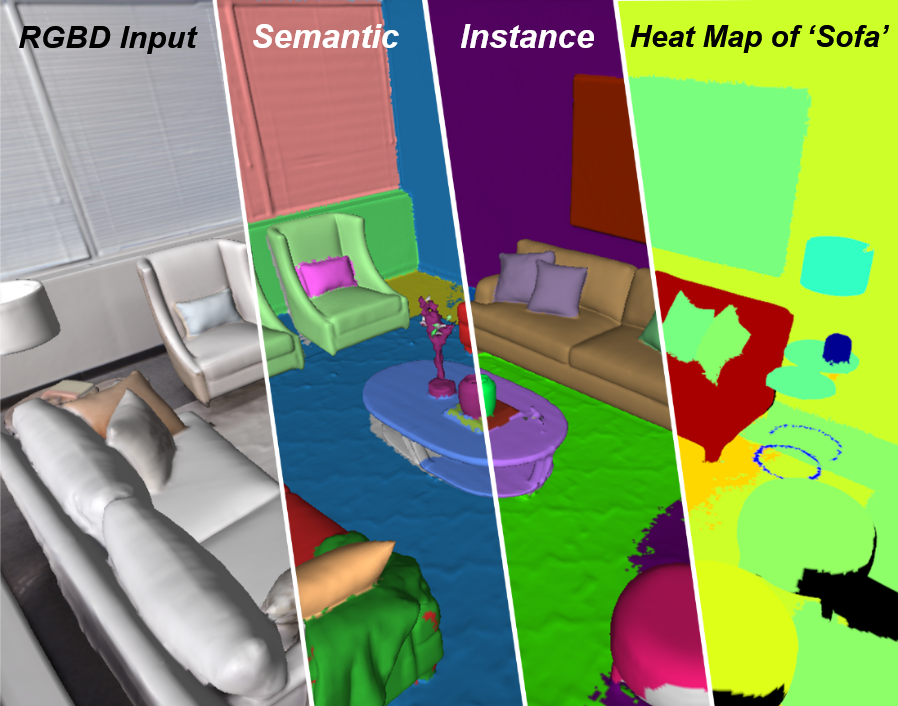
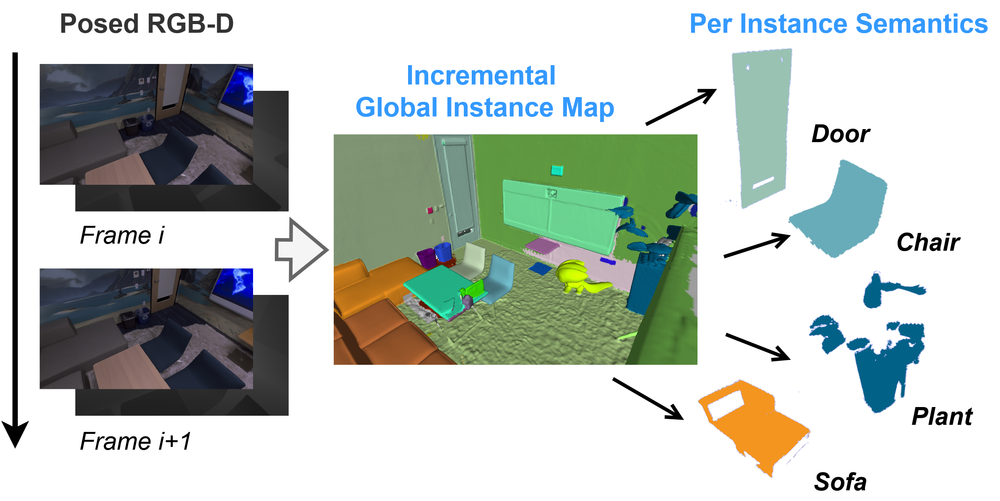

<!-- markdownlint-disable MD033 MD041 -->
<div align="center">

# 🗺️🔍 OVI-MAP: Open-Vocabulary Instance-Semantic Mapping

## CVPR 2026 Highlight✨

<a href="https://dzl666.github.io/">Zilong Deng</a><sup>1,3</sup>,
<a href="https://scholar.google.de/citations?user=TFsE4BIAAAAJ">Federico Tombari</a><sup>2,4</sup>,
<a href="https://people.inf.ethz.ch/pomarc/">Marc Pollefeys</a><sup>1,5</sup>,
<a href="https://scholar.google.com/citations?user=dfjN3YAAAAAJ">Johanna Wald</a><sup>2,\*</sup>,
<a href="https://scholar.google.com/citations?user=U9-D8DYAAAAJ">Daniel Barath</a><sup>1,2,\*</sup>
<br>
<sup>1</sup>ETH Zurich&emsp;
<sup>2</sup>Google&emsp;
<sup>3</sup>University of Zurich&emsp;
<sup>4</sup>TU Munich&emsp;
<sup>5</sup>Microsoft&emsp;
<sup>\*</sup>Equal contribution

### <a href="https://arxiv.org/abs/2603.26541">Paper</a> | <a href="https://ovi-map.github.io/">Project Page</a> | <a href="https://cvpr.thecvf.com/virtual/2026/poster/39644">Poster & Video</a>

</div>

<div align="center">
  
  
</div>

This is the official implementation of the CVPR2026 paper **OVI-MAP**.
Contact: deng_zilong[at]outlook.com

### BibTex

<pre><code>@InProceedings{deng2026ovimap,
  author    = {Deng, Zilong and Tombari, Federico and Pollefeys, Marc and Wald, Johanna and Barath, Daniel},
  title     = {OVI-MAP: Open-Vocabulary Instance-Semantic Mapping},
  booktitle = {Proceedings of the IEEE/CVF Conference on Computer Vision and Pattern Recognition (CVPR)},
  month     = {June},
  year      = {2026},
  pages     = {12606-12616}
}
</code></pre>

## Table of Contents

- [Installation](#installation)
  - [Option A: Docker (Recommended)](#option-a-docker-environment-recommended)
  - [Option B: Local Environment](#option-b-local-environment-for-ubuntu-2004)
- [Dataset](#dataset)
- [How to Use It](#how-to-use-it)
- [Acknowledgements](#acknowledgements)
- [FAQ / Bug fixing](#faq--bug-fixing)

### Timeline

- [x] 2026/05/13: Release original code & interactive visualization tools (there might be some bugs for a fresh start. I am still working on it, thanks for your patience :))
- [x] 2026/06/01: V0.9, Bug fixing and cleaning the codebase.
- [x] 2026/07/27: We release the refactored codebase for easier installation and deployment！Check out the branch **origin_impl** for the original code.

## Installation

### Download the Repo

```bash
git clone https://github.com/OVI-MAP/OVI-MAP.git
```

### [Option A] Docker Environment (Recommended)

If you are on Ubuntu 22.04+ (or any system without native ROS Noetic support), use Docker:

- [Docker](https://docs.docker.com/engine/install/ubuntu/)
- [NVIDIA Container Toolkit](https://docs.nvidia.com/datacenter/cloud-native/container-toolkit/latest/install-guide.html) (for GPU support)

#### Two conda environments inside the container

| Environment               | Python | Purpose                                        |
|---------------------------|--------|------------------------------------------------|
| `ovimap-py38`             | 3.8    | Reconstruction + ROS pybind11 modules          |
| `ovimap-perception-py310` | 3.10   | Perception (Cropformer/SigLIP/CLIP inference)  |

The async pipeline spawns the perception worker as a subprocess using
`/opt/conda/envs/ovimap-perception-py310/bin/python`, communicating via shared memory + pipes
inside the same container.

#### Build the image

```bash
# Modify line 75 of docker/Dockerfile to pick your torch.
bash docker/build.sh
```

First build takes ~20 minutes (installs ROS, conda envs, Python packages). The image is ~25 GB.

#### Run and attach to the container

This mounts the repo root at `/workspace` and `~/Data` at `/data`.

```bash
# Set `DATA_DIR` to override
DATA_DIR=/path/to/your/datasets bash docker/run.sh
```

#### ROS workspace installation (inside the container)

This runs `catkin build consistent_gsm depth_segmentation_py`.
The ROS workspace is built with system Python.

```bash
bash docker/setup_workspace.sh
```

### [Option B] Local Environment (for Ubuntu 20.04)

#### Install ROS (required by the backend with voxblox)

```bash
sudo sh -c 'echo "deb http://packages.ros.org/ros/ubuntu $(lsb_release -sc) main" > /etc/apt/sources.list.d/ros-latest.list'

sudo apt install curl
curl -s https://raw.githubusercontent.com/ros/rosdistro/master/ros.asc | sudo apt-key add -
sudo apt update

sudo apt install ros-noetic-desktop
```

#### Dependencies

```bash
sudo apt install python3-dev python3-pip python3-wstool protobuf-compiler dh-autoreconf \
    python3-catkin-tools python3-osrf-pycommon python3-empy \
    libflann-dev libgl1-mesa-dev libvtk7-dev pybind11-dev libgflags-dev libgoogle-glog-dev
```

#### Conda Environments

> You need two separate conda environments: one for reconstruction (Python 3.8, used with ROS)
> and one for perception (Python 3.10, used for VLM inference).
>
> If you don't need to run with SigLip2, you can use only one python 3.8 env.

**ovimap-py38** — Python 3.8, reconstruction scripts + ROS pybind11 modules:

```bash
conda create -n ovimap-py38 python=3.8.10
conda activate ovimap-py38
python -m pip install empy==3.3.4 pyparsing\<3 pybind11 tqdm open3d scipy \
    opencv-contrib-python==4.11.\* plyfile h5py matplotlib
conda deactivate
```

**ovimap-perception-py310** — Python 3.10, perception worker (SigLIP/CLIP):

```bash
conda create -n ovimap-perception-py310 python=3.10
conda activate ovimap-perception-py310
# Pick your torch
python -m pip install --index-url https://download.pytorch.org/whl/cu128 \
    torch==2.7.1 torchvision==0.22.1
python -m pip install transformers==4.49.\* opencv-python-headless==4.11.\* Pillow tqdm \
    ftfy regex accelerate\>=0.26 sentencepiece protobuf setuptools open3d plyfile
conda deactivate
```

#### Install Third Party Packages

```bash
cd mapping_ros_ws
catkin init
catkin config --extend /opt/ros/noetic --merge-devel
catkin config --cmake-args -DCMAKE_CXX_STANDARD=14 -DCMAKE_BUILD_TYPE=Release -DPYTHON_EXECUTABLE=/usr/bin/python3
wstool init src

cd src
wstool merge -t . consistent_panoptic_mapping/consistent_panoptic_mapping.rosinstall
wstool update
```

#### Build the Environment

The ROS workspace is built with **system Python**, not conda. Make sure you are
**not** inside any conda environment when building:

```bash
conda deactivate
cd mapping_ros_ws/src
catkin build consistent_gsm depth_segmentation_py
```

## Dataset

Download and pre-process the dataset, put them under: **[path_to_datasets]/[dataset_name]**

### Replica

Download the Replica dataset pre-processed by [NICE-SLAM](https://pengsongyou.github.io/nice-slam).

```bash
cd [path_to_dataset]
wget https://cvg-data.inf.ethz.ch/nice-slam/data/Replica.zip
unzip Replica.zip && rm Replica.zip
```

### ScanNet

You need to download the dataset yourself from [ScanNet](https://kaldir.vc.in.tum.de/scannet_benchmark/documentation).
We prepared some scripts for you to extract the data you need, see: **scripts/datasets**

### Prepare the GT instance & semantic mesh for evaluation

Modify the data locations in **scripts/datasets/preprocess_gt_mesh.py**, and run it to convert the original GT labels to the unified meshes with vertex labels.

```bash
python -m scripts.datasets.preprocess_gt_mesh --scene_num office0
```

## How to Use It

### Run CropFormer

Prepare your dataset and run [Cropformer](https://github.com/qqlu/Entity/blob/main/Entityv2/CODE.md).
Please follow their instruction to install the repo separately. We will release the integrated segmentor in the next version.

Modify the code under **Cropformer/demo_cropformer/demo_from_dirs.py**, output the results as **.png** files:

```python
# save mask id to png file
f_name= os.path.basename(path).replace('jpg', 'png')
out_filename = os.path.join(args.output, f_name)
cv2.imwrite(out_filename, mask_id)
```

For all of the experiments shown in the OVI-MAP paper, we ran entity segmentation from Cropformer with the official *CropFormer_hornet_3x_03823a* model and the default settings:

```bash
python projects/CropFormer/demo_cropformer/demo_from_dirs.py --config-file [path_to_repo]/CropFormer/configs/entityv2/entity_segmentation/cropformer_hornet_3x.yaml --opts MODEL.WEIGHTS [path_to_ckpts]/CropFormer_hornet_3x_03823a.pth 
```

> Model can be downloaded from: [CropFormer_hornet_3x_03823a.pth](https://huggingface.co/datasets/qqlu1992/Adobe_EntitySeg/blob/main/CropFormer_model/Entity_Segmentation/CropFormer_hornet_3x/CropFormer_hornet_3x_03823a.pth)

### Data Arrangement

Group all of the RGB segmentation results by the name of the scene, and place them like:

```text
[workspace dir]
  ├──geo_seg_temp/      (temp storage of the depth segmentation results, if needed)
  └──sem_seg_temp/      (temp storage of the RGB segmentation results, if needed)
      ├──office0/         (e.g.: Segmentations of the RGB images from Replica-office0)
          ├──frame000000.png
          ├──framexxxxxx.png
          └──frame001999.png
      ├──scene0011_00/    (e.g.: Segmentations of the RGB images from ScanNet-scene0011_00)
          ├──0.png
          ├──xxx.png
          └──1999.png
      └──[SceneName]/
```

> MAKE SURE YOU ARE SAVING THE MASKS AS **PNG** FILES!!!!!

The file name of the segmentation masks should match the name of the original RGB image, otherwise please adapt the mask loading code in **scripts/panoptic_mapping_.py**.

### Run the pipeline

```bash
# 
conda activate ovimap-py38
# source the ros env to find the compiled backend
source mapping_ros_ws/devel/setup.bash

# Async pipeline (reconstruction + perception worker)
bash scripts/run_async.sh office0

# Or manually
python scripts/panoptic_mapping_.py \
    --dataset replica --task Nyu40 \
    --scene_num office0 \
    --data_folder /data/Datasets/Replica \
    --start 0 --end 2000 --step 10 \
    --data_association 2 --inst_association 4 --seg_graph_confidence 3 \
    --temp_panoptics_folder /data/sem_seg_temp/office0 \
    --save_temp_geometrics --temp_geometrics_folder /data/geo_seg_temp/office0 \
    --result_folder /data/semantic_mapping_result/office0 \
    --perception_python /opt/conda/envs/ovimap-perception-py310/bin/python \
    --perception_worker scripts/perception_worker.py \
    ...
```

### Run Post-Processing

You would need to switch to your python 3.10 environment from here, in order to use torch.

```bash
conda deactivate && conda activate ovimap-perception-py310
```

#### [Step 1] Map the generated instance mesh and per-instance semantics to the GT mesh and the dataset's labels

```bash
python -m scripts.utils.mesh_postprocess_utils --scene_num office0
```

#### (After Step 1) Evaluate the instance segmentation accuracy

```bash
python -m scripts.eval_inst_seg --scene_num office0
```

#### (After Step 1) Evaluate the semantic segmentation accuracy

You need to modify the scene list for your specific dataset.
Make sure you have all the converted (mapped to the gt mesh) instance meshes and semantic meshes of your selected scenes above.

```bash
python -m scripts.eval_sem_seg
```

#### (After Step 1) Heat Map Querying

Here we only need the instance mesh mapped to the GT mesh, and the per-instance semantics.
You can also use the raw generated mesh, but it's too large and will take a lot of resources.

```bash
python -m scripts.visualizations.search_heatmap --scene_num scene0011_00 --search_text sofa
```

## Acknowledgements

The code for class-agnostic instance segmentation was built upon the code of [ConsistentPanopticSLAM](https://github.com/y9miao/ConsistentPanopticSLAM). We sincerely thank the authors.

## FAQ / Bug fixing

### Typo in the paper

We use a voxel size of **0.01** meter in all experiments with our instance mapping method.

### Installation Problems

If you cannot build opencv when **Installing Third Party Packages**, try to manually download these files.

```bash
cd mapping_ros_ws/build/opencv3_catkin/opencv3_contrib_src/modules/xfeatures2d/src/

wget https://raw.githubusercontent.com/opencv/opencv_3rdparty/34e4206aef44d50e6bbcd0ab06354b52e7466d26/boostdesc_bgm.i
wget https://raw.githubusercontent.com/opencv/opencv_3rdparty/34e4206aef44d50e6bbcd0ab06354b52e7466d26/boostdesc_bgm_bi.i
wget https://raw.githubusercontent.com/opencv/opencv_3rdparty/34e4206aef44d50e6bbcd0ab06354b52e7466d26/boostdesc_bgm_hd.i
wget https://raw.githubusercontent.com/opencv/opencv_3rdparty/34e4206aef44d50e6bbcd0ab06354b52e7466d26/boostdesc_lbgm.i
wget https://raw.githubusercontent.com/opencv/opencv_3rdparty/34e4206aef44d50e6bbcd0ab06354b52e7466d26/boostdesc_binboost_064.i
wget https://raw.githubusercontent.com/opencv/opencv_3rdparty/34e4206aef44d50e6bbcd0ab06354b52e7466d26/boostdesc_binboost_128.i
wget https://raw.githubusercontent.com/opencv/opencv_3rdparty/34e4206aef44d50e6bbcd0ab06354b52e7466d26/boostdesc_binboost_256.i

wget https://raw.githubusercontent.com/opencv/opencv_3rdparty/fccf7cd6a4b12079f73bbfb21745f9babcd4eb1d/vgg_generated_48.i
wget https://raw.githubusercontent.com/opencv/opencv_3rdparty/fccf7cd6a4b12079f73bbfb21745f9babcd4eb1d/vgg_generated_64.i
wget https://raw.githubusercontent.com/opencv/opencv_3rdparty/fccf7cd6a4b12079f73bbfb21745f9babcd4eb1d/vgg_generated_80.i
wget https://raw.githubusercontent.com/opencv/opencv_3rdparty/fccf7cd6a4b12079f73bbfb21745f9babcd4eb1d/vgg_generated_120.i
```

### CropFormer related

#### a)

If you are using the latest version of pytorch (PyTorch 2.7 for instance), you might need to edit two lines of **CropFormer/mask2former/modeling/pixel_decoder/ops/src/cuda/ms_deform_attn_cuda.cu** to install it.

> Adding two 'scalar_' prefix:
>
> line  69: AT_DISPATCH_FLOATING_TYPES(value.**scalar_**type(), "ms_deform_attn_forward_cuda", ([&] {
>
> line 139: AT_DISPATCH_FLOATING_TYPES(value.**scalar_**type(), "ms_deform_attn_backward_cuda", ([&] {

#### b)

Comment out **CropFormer/mask2former/data/datasets/**init**.py** to skip the installation of mmcv.
